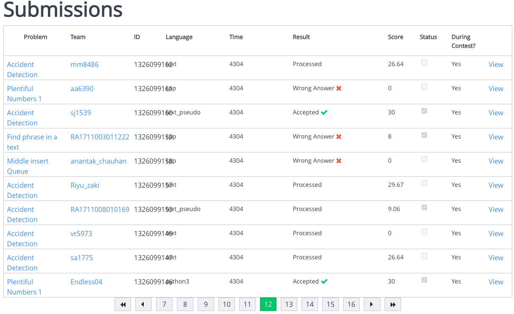
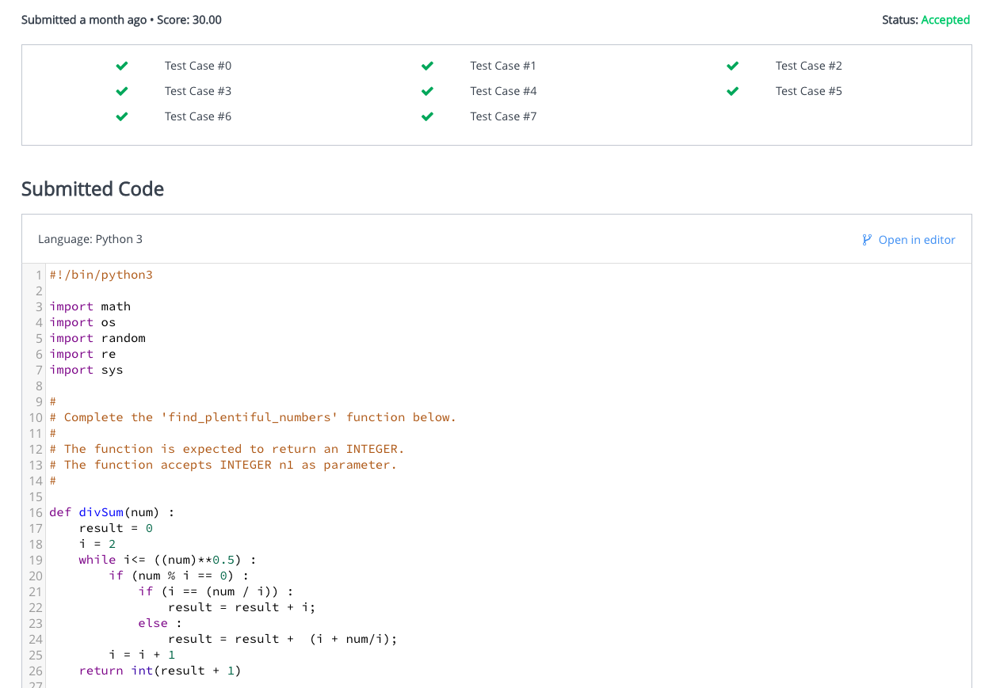
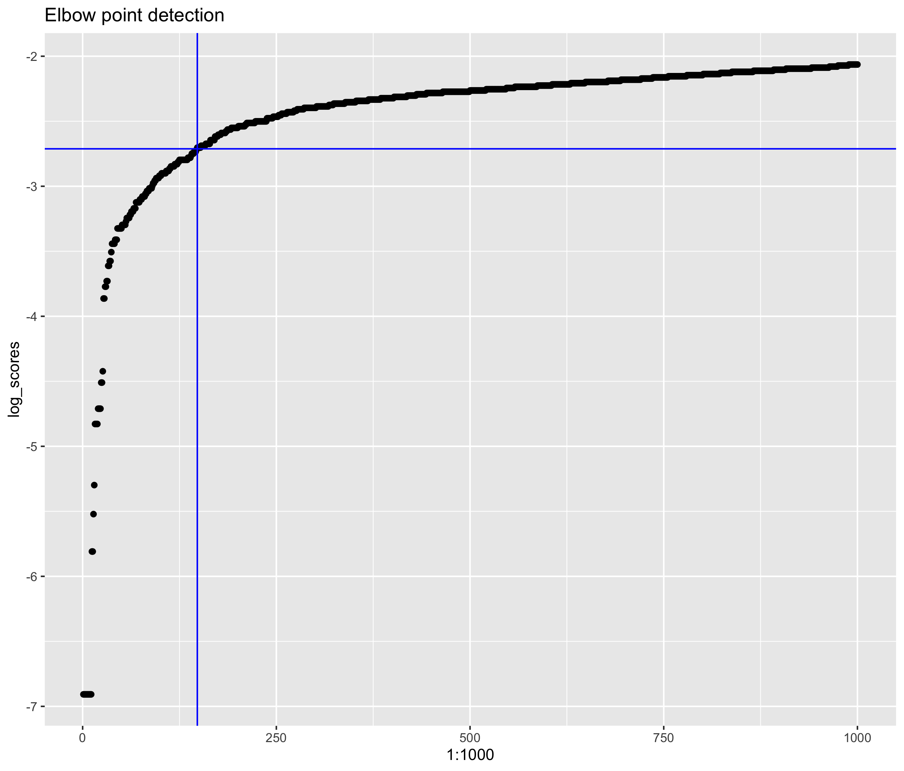
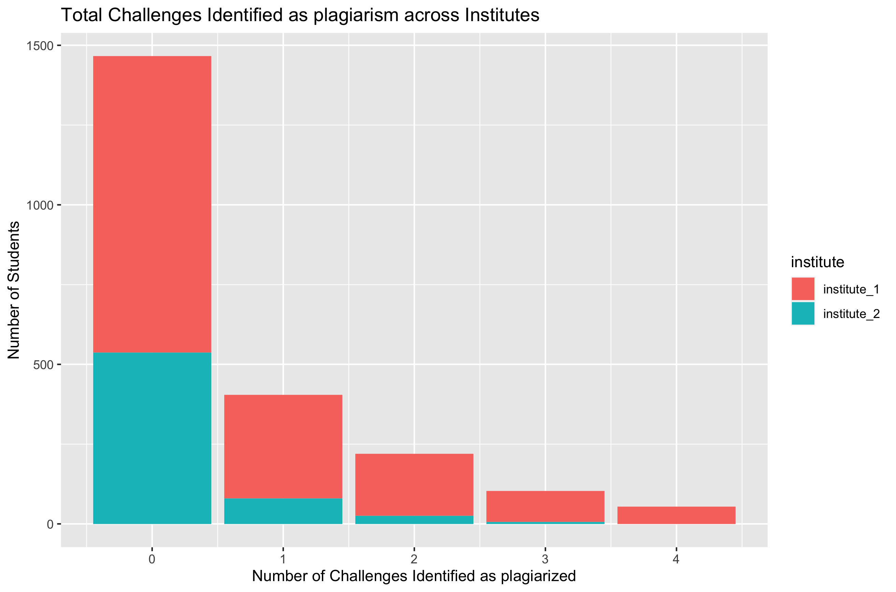
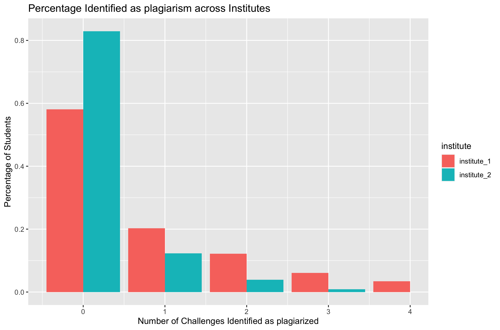

# hackerrank-plagiarism-detection

## Problem Statement

Competitive Programming is commonly used as a way to check the competence of candidates, especially when the number of applicants are large. The results of the program is checked against previously verified results to generate a score for each user to create the leader board. However, in many cases, logistical challenges make it difficult to ensure that the candidates are not cheating by collaborating with each other, especially since most exams are conducted online without any supervision. Since only the value of the outputs are checked, this gives the cheating participants a high score at the detriment of the candidates who haven't cheated.

In this project, I'll be trying to identify cases of plagiarism for a particular programming challenge conducted at the firm where I'm working currently.

*Note: I've obtained permission from the organization I work with to use the dataset, and all the Personally Identifiable Information is anonymized before analysis as well.*

## Data Source

The data is not easily available since the free version of the website which was used to conduct the test doesn't give any APIs to access the data. Hence for first part of tackling the problem I got the data by using scraping techniques from the competition website. For this, I used `Python` with `Selenium` to do the following steps. The scraping tool built in `Selenium` has throttling built-in to prevent DoSing the server.

1. Login to the website using credentials
2. Get the list of solutions which are final submissions from the leader board with status: Accepted (Fig 1)
3. Get the submission code themselves from the individual pages (Fig 2)

The data from each submission was stored in a local SQLite database for easy retrieval.

Once the data is retrieved, all personally identifiable information like usernames was anonymized at source before the analysis to protect privacy for this exercise. Usernames were anonymized using a hashing function. The users were from one of two institutes, here anonymized as `institute_1` and `institute_2`. In total, each user participated in a maximum of 5 challenges (`Crossing Ants`, `Find phrase in a text`, `Middle insert Queue`, `Plentiful Numbers 1`, `Seesaw Pivot`).

At the end of this step, input data looks like this (code column truncated):

|#  | user   | challenge     | code                                                                                                    | institute   |
|---|--------|---------------|---------------------------------------------------------------------------------------------------------|-------------|
| 1 | 58db10 | Crossing Ants | #include <math.h> #include <stdio.h> #include <string.h> #include <stdlib.h> #include <assert.h> #in... | institute_1 |
| 2 | e68150 | Crossing Ants | #!/bin/python3 import math import os import random import re import sys # # Complete the 'find_tot...   | institute_1 |
| 3 | e6d99c | Crossing Ants | #include <bits/stdc++.h> using namespace std; string ltrim(const string &); string rtrim(const str...   | institute_1 |
| 4 | e873e9 | Crossing Ants | #include <bits/stdc++.h> using namespace std; string ltrim(const string &); string rtrim(const str...   | institute_1 |
| 5 | 7db876 | Crossing Ants | import java.io.*; import java.util.*; import java.text.*; import java.math.*; import java.util.regex... | institute_1 |
| 6 | e5204d | Crossing Ants | #include <bits/stdc++.h> using namespace std; string ltrim(const string &); string rtrim(const str...   | institute_1 |

## Methodology

### Creating a plagiarism metric for each submission

The first thing that we do is to create a metric to identify two submissions that have been plagiarized. For this, we're going to assume that plagiarized code has similar content in text. The distance of each submission with respect to all the other submissions need to be calculated. For this we can use various [String Metrics](images/https://en.wikipedia.org/wiki/String_metric). The following string metrics were considered:

1. Levenshtein Distance
2. Hamming Distance
3. Jaro Winkler Distance
4. Jaccard index

Hamming distance is the simplest string distance function. It identifies the number of locations where the characters are different between two strings. However, it requires the two strings to have the same length. In this case it is not always true that people who plagiarized the code would not have made any changes, since an additional space, or renaming a variable or even a newline character can cause significant differences.

Levenshtein Distance was another possibility. In small scale tests, it yielded really good results, but the computational complexity of this distance function is of an order of complexity $O(n^2)$. However, we had a length > 10000 characters for many challenge submissions, and this meant that the computation complexity was too much and the program took too long to finish. Hence this was discarded for practical reasons.

Jaccard index is another fast distance metric, but it measures similarity between sets and doesn't consider ordering of the characters. Naturally, we couldn't use this as a metric for this.

Jaro Winkler distance was chosen as the best approach since there are implementations of this with a linear computational complexity and it was found to give good results while eyeballing.

The distance metrics were implemented in `R` using the `stringdist` package which has built-in functions for all of these distance metrics. At the end of this step, we get 5 tables, one for each challenge, with an `nxn` matrix where n is the number of submissions for each challenge.

Once we have the distance metric for each submission against every other submission for the same challenge, we can try to assign a similarity score to each submission. In this case, the similarity score against all the other submissions were taken and the top similarity score was selected as the similarity score for each submission. This means that for each submission, the score to the closest submission will be selected as it's score. The higher the score, the more a submission is different from every other submission. Users who didn't do a submission were assigned a score of 1 (no similarity).

Sample output once the scores have been identified:

| # | user   | Crossing Ants | Find phrase in a text | Middle insert Queue | Plentiful Numbers 1 | Seesaw Pivot |
|---|--------|---------------|-----------------------|---------------------|---------------------|--------------|
| 1 | 000ea1 |         0.000 |                 0.000 |               0.000 |               0.188 |        0.000 |
| 2 | 002184 |         0.057 |                 1.000 |               0.071 |               0.120 |        0.118 |
| 3 | 002530 |         0.064 |                 0.148 |               0.108 |               0.155 |        1.000 |
| 4 | 003f2f |         0.064 |                 0.169 |               0.123 |               0.099 |        0.138 |
| 5 | 006a59 |         0.038 |                 0.074 |               0.089 |               0.111 |        0.087 |
| 6 | 0093aa |         0.074 |                 1.000 |               1.000 |               1.000 |        1.000 |

In the above case, we can see that user `000ea1` has four submissions that were identical (score: `0.000`) to other submissions in the dataset. User `006a59` has one submission which was similar to at least one another submission (score: `0.038`).

### Identifying plagiarism threshold for each challenge

Now that we have the plagiarism score, we need to identify a threshold which classifies submissions as plagiarized or not. One option is to give a threshold of `0`, which means that only submissions that are perfectly identical to the others will classified as plagiarized. However, this means that even simple changes to the code won't be identified (False Negative, Type II error). On the contrary, having too high a threshold will cause submissions which were not copied from each other, but accidentally managed to be similar to each other will be flagged as plagiarized (False positive, Type I error).

Also, each challenge is of a different complexity, and the chances that two submissions are accidentally similar to each other are higher in the simpler assignments, rather than the complex ones. Hence we need to create an adaptive threshold depending on the data itself.

For this particular problem, this was done by using an elbow point detection algorithm on the log of the sorted submission scores. The elbow point detection algorithm finds the point in the curve with the maximum change in the slope (second derivative) as the elbow point. This can be imagined as the point where there is a large variation between the regimes of plagiarized and non plagiarized data (Fig 3).

## Visualization and Evaluation

### Visualizing Results

Once the threshold of similarity scores for each individual challenge has been identified, we can now identify the users who have a high probability of having plagiarized. This was implemented as a simple thresholding rule and each user was assigned a score depending on how many of their submissions were closer to the plagiarism threshold. The results are shown below (Fig 4).

From the above graph, we can quickly summarize that a bulk majority of the students haven't engaged in plagiarism of any sort. However, a significant chunk of students have been involved in 1,2,3 and 4 submissions which were identified as being plagiarized. In addition, we can see clear differences in the behavior across institutes, which are better visualized using the percentage summary statistics below:

Although `institute_1` had a lot more students (from the graph above in Fig 5), it turns out students of `institute_2` have been involved in significantly less copying from each other.

### Evaluation and Final Results

In this case, since the true output is not known, it is not easy to evaluate whether the algorithm is exact or not. However, we can gain some confidence on the validity of the analysis by performing some clustering analysis on how the plagiarism chain has spread across users.

In this case we try to use the techniques we learned in the class to form a network of students who copied from each other. In the graph below (Fig 6), each node represents a student and an edge represents two students who have at least one submission that are very similar to each other. The color of the networks represent the institute of the students.

, we can clearly see clusters of the same colors which are closely connected to each other. This represents students of the same institute who have copied the answers en masse and distributed. This is much more prevalent in `institute_1`, but we see a few clusters in `institute_2` as well. However, the interconnection between the red and green colors are very rare (it's more logistically difficult to engage in plagiarism across institutes) which shows that the detection is performing well.

In addition to the above, it was anecdotally observed that the students in `institute_1` had more opportunity to plagiarize from each other size because the challenges lasted for multiple days in `institute_1`, but the duration was cut down to a few hours in `institute_2`. This results is also corroborated by the number where the number of students who have indulged in plagiarism is ~0.57 in `institute_1`, but much higher at `0.82` in `institute_2`.

For the real life scenario, it is possible that there are some false positives where two candidates who haven't plagiarized, and hence this was used as only one of the criteria for candidate selection/rejection. In addition, we give can give another safety factor by which the threshold is scaled to make sure that even if some students who plagiarized were let off, we didn't unnecessarily penalize students whose code accidentally happened to be similar to other students.

